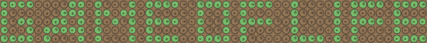

Conway's Game of Life written in Typescript. Run [it in browser](https://rodionbgd.github.io/game_of_life/).

## 🛠 Features

- ✂️ Live resizable gamefield 
- 🎚 Speed changing
- ✅ Add/remove cells
- ▶️️ Next step preview
- 🧮 Randomly generated gamefield

# Support
Please [open an issue](https://github.com/rodionbgd/game_of_life/issues) for support or even more [open a pull request](https://github.com/rodionbgd/game_of_life/pulls).

# License
This project is open source. Enjoy using it.

# Contacts
Don't hesitate to ask me whatever you want. Stay tuned for more awesome projects :smile:. Follow me or Connect me via <a href="https://t.me/rodionbgd">Telegram</a>.
